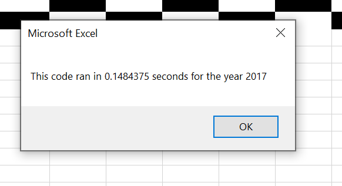
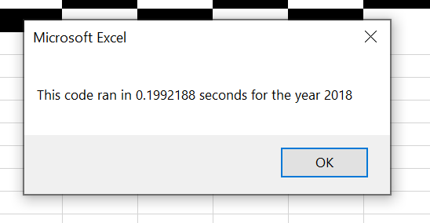
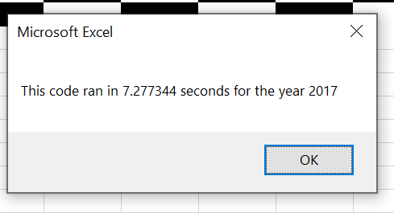
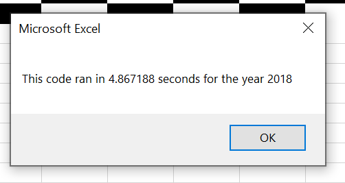

# Stocks Analysis

## Overview of Project:
Using the Stocks dataset and the original 'AllStocksAnalysis' subroutine code, we refactored it into 'AllStocksAnalysisRefactored' and made it more efficient in terms of its runtime. This would be very useful for Steve, who is helping out his parents analyze and choose a few stocks to invest in using their historical data and if he wants to run this code on the entire stock market over the past few years, he can now do it much faster! 

## Results:
The very first step was to download the rough draft of our refactored code and fill in the missing items that were basically the part of the program that were different from our previous code for the original subroutine 'AllStocksAnalysis' and were therefore responsible for making it more efficient. The code that was filled in is as follows:
```'Activate data worksheet
    Worksheets(yearValue).Activate
    
    'Get the number of rows to loop over
    RowCount = Cells(Rows.Count, "A").End(xlUp).Row
    
    '1a) Create a ticker Index
    tickerIndex = 0 

    '1b) Create three output arrays   
    Dim tickerVolumes(12) As Long  
    Dim tickerStartingPrices(12) As Single
    Dim tickerEndingPrices(12) As Single  
    
    ''2a) Create a for loop to initialize the tickerVolumes to zero. 
    For i = 0 To 11
        tickerVolumes(i) = 0
        tickerStartingPrices(i) = 0
        tickerEndingPrices(i) = 0
    
    Next i 
        
    ''2b) Loop over all the rows in the spreadsheet. 
    For i = 2 To RowCount
    
        '3a) Increase volume for current ticker
        tickerVolumes(tickerIndex) = tickerVolumes(tickerIndex) + Cells(i, 8).Value
        
        '3b) Check if the current row is the first row with the selected tickerIndex.
        
         If Cells(i, 1).Value = tickers(tickerIndex) And Cells(i - 1, 1).Value <> tickers(tickerIndex) Then 
            tickerStartingPrices(tickerIndex) = Cells(i, 6).Value 
        End If 
            
        
        '3c) check if the current row is the last row with the selected ticker
         'If the next row’s ticker doesn’t match, increase the tickerIndex.
        
        If Cells(i, 1).Value = tickers(tickerIndex) And Cells(i + 1, 1).Value <> tickers(tickerIndex) Then
            tickerEndingPrices(tickerIndex) = Cells(i, 6).Value
        End If 
            

            '3d Increase the tickerIndex. 
            If Cells(i, 1).Value = tickers(tickerIndex) And Cells(i + 1, 1).Value <> tickers(tickerIndex) Then
                tickerIndex = tickerIndex + 1 
            End If  
            
        'End If
    
    Next i
    
    '4) Loop through your arrays to output the Ticker, Total Daily Volume, and Return.
    For i = 0 To 11
    
    Worksheets("All Stocks Analysis").Activate
    Cells(4 + i, 1).Value = tickers(i)
    Cells(4 + i, 2).Value = tickerVolumes(i)
    Cells(4 + i, 3).Value = tickerEndingPrices(i) / tickerStartingPrices(i) - 1
        
        
    Next i
```
Our run time got reduced pretty significantly after refactoring the code which can be seen as follows:




## Summary:
### The advantages or disadvantages of refactoring code:
The first and the foremost advantage as seen above is how fast the execution of our refactored code becomes. It takes lesser runtime from our previous unfactored code which means it tends to be more efficient. Secondly, it makes our code look somewhat more organized, which in turn makes it easier for the viewer or the user of our code. Also, it might be useful in debugging our program! At the same time, refactoring might increase our problems because if we do it incorrectly, it might introduce new bugs in our program. Another issue here is that overall, the functionality and the results that our program produces do not change! 

### The advantages and disadvantages of the original and refactored VBA script:
The advantage of refactored VBA script is a significant reduction in the program runtime, which can be seen as follows:
(These are the screenshots from the previous unfactored code's execution time and can be compared to the screenshots above in the results portion of this document where those screenshots are from the refactored VBA script's execution time)




The disadvantage of the VBA script is that it is a bit more complex for a new user.
The disadvantage of the original VBA script is that it runs slow, whereas its advantage would be that it is much more simple in terms of understanding.


